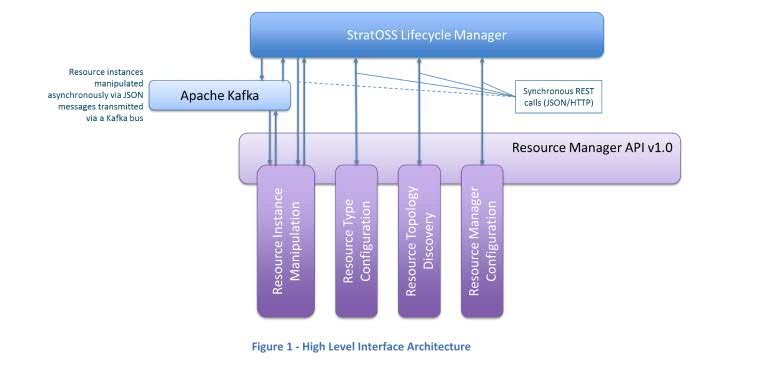

# Open Source Service Lifecycle Management (OSSLM)

The Open Source Service Lifecycle Management (**OSSLM** for short) project contains Resource Manager (VNFM) API specifications and sample Resource Manager adaptor implementations.

Use **OSSLM** to create your own Resource Manager adaptor implementation that adhere to the API or extend the existing code modules to add new capabilities.The Resource Manager API is responsible for defining the interactions between a lifecycle manager and the resource managers that are used to manage resources within virtual (or physical) infrastructures.

Complete SDK documentation can be found in the [*doc* directory](doc/).

We use GitHub issues for tracking requests and bugs. If you'd like to contribute to OSSLM, please take a look at our [contribution guidelines](CONTRIBUTING.rst).

Links to Sections:

* [Pre-reqs](#Pre-reqs)
* [Creating your first Resource Manager Adaptor](#creating-your-first-rm-adaptor)
* [More Information](#more-information)
* [Authors](#authors-alphabetical)
* [License](#license)

## Pre-reqs
- docker version >= 17.06.0-ce
- docker-compose version >= 1.14.0

For the UCD adaptor [Java 1.8 JDK] is needed to build the adaptor. For the ansible adaptor python knowldge is required.
In addition, an understanding of REST is helpful when interacting with OSSLM API docs.

## Creating your first Resource Manager Adaptor
Sample implementations of Resource Manager adaptors are available for
* [Urban Code Deploy](https://github.com/IBM/osslm-ucd-adaptor)
* [Ansible](https://github.com/IBM/osslm-ansible-resource-manager)
* [Docker](https://github.com/IBM/osslm-docker-adaptor)
* [OpenSource MANO](https://github.com/IBM/osslm-OpenSourceMANO-adaptor)
## More Information

* **[API Specs]**,
  a good starting place for learning about Resource Manager API [here](doc/).

## Authors (alphabetical)

Jochen Kappel, Tony O'Brien

In future releases, anyone who contributes with code to this project is welcome to include their name here.

## License

This project uses the [Apache License Version 2.0 software license](https://www.apache.org/licenses/LICENSE-2.0).
